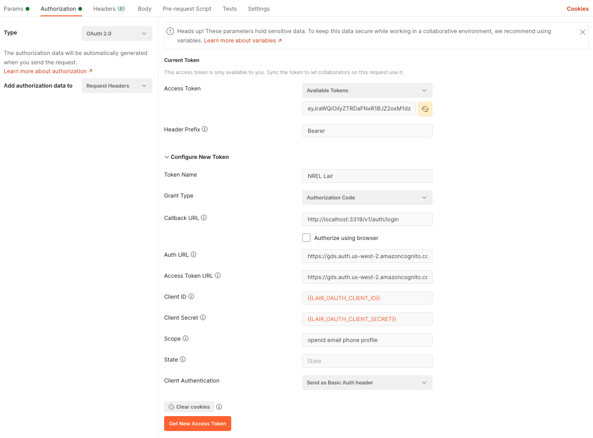

# @nrel-gds http-server

A tidy little collection configuration, middlewares, runtime setup, and CI tooling useful as a template for creating NodeJS APIs. While this project will run as a stand-alone service itself, the real use-case is to take advantage of the exported classes in a separate project that implements an actual service.

## What does it provide

- A basic Express server
- CORS middle ware that whitelists and nrel.gov address as well as localhost and 127.0.0.1
- Logging configuration customizeable by environment and configuration
- Any features required by Cyber for compliance at the server level
- Bootstrap and Tidy up features to ensure that connection pools are cleanly handled
- Error handling for timeouts and unexpected shutdowns
- Support for containerization and deployment to AWS within GDS CI systems

## Usage as template for Node API

- initialize a new node package
- add `@nrel-gds/http-server` as a dependency
- create an index.js file with (at least) the following
```javascript
#!/usr/bin/env node

// This fires up the server using all the default setup and
// gives you access to the Express server, app, and router
let {server, app, router, proxy} = require('@nrel-gds/http-server');
let logger = require('@nrel-gds/node-api-utils').logger;

// need to add a middleware?
app.use(function (req, res, next) {
  console.log('Time:', Date.now())
  next()
})

// need to add a route?
router.route('/v1/chartData')
  .get(function (req, res) {
    res.send('hello world')
  }
);

// You can log stuff
logger.info("My service is running");

// If you need to perform pre-shutdown cleanup duties, add
// a promise to the collection like so:
server.addTeardownCallback(function() {
  return new Promise((resolve, reject) => {
    logger.debug("This is what clean looks like");
    resolve();
  });
});

// Pay it forward (for testing harness if nothing else)
module.exports = {
  app,
  router,
  server,
  proxy
}
```

In addition to the above simple case, it is also desireable to add
- A config directory and relevant configuration files
- A .env file with a DB_CONN_STR if needed
- an infinite variety of actual endpoints to do service work
- A scripts section in the package.json including
```json
"scripts": {
    "start": "node ./index.js",
    "start-dev": "nodemon --inspect ./index.js",
    "doc": "./node_modules/.bin/jsdoc --readme JSDOC_README.md -r -c .jsdoc -d docs",
    "test": "NODE_ENV=test jest",
    "containerize": "node ./node_modules/@nrel-gds/http-server/scripts/containerize.js"
  }
  ```
An example of a brand new consumer of http-server at [this commit](https://github.nrel.gov/vadr/vadr/commit/f4fc97be3fa804c156e32bfc05e120604e4ff8f2).


## Getting Started

- `yarn install`
- `yarn start` OR `yarn start-dev`

### Environment Variables

| ENV var | possible value(s) | purpose |
| ------- | ----------------- | ------- |
| DB_CONN_STR | a valid pg db connection string | If present, will define the db connection. If not present, no DB connection will be attempted |
| NODE_ENV | development/test/staging/production | Primarily determines which configuration file values are used. Also instructs certain log behavior |

Enviornment variables can be added to the local shell via `.bashrc`, or through [dotenv](https://www.npmjs.com/package/dotenv). Dotenv supports ability to add environment variables as config file entires in the `.env` file. `.env` must never be committed to the git repo, so for ease of use there is an example file to refer to at `.env.example`.

### Configuration Variables

| config var | possible value(s) | purpose |
| ------- | ----------------- | ------- |
| PORT | a valid port # | The port to accept incoming http requests on |
| APP_NAME | A string | Used in any render templates as the HTML title and occassionally as a header on the page |
| PROXY_PATH | A string | Used when deploying to AWS to define the reverse proxy path e.g for https://maps-api.nrel.gov/rade the value would be `rade` |
| LOG_LEVEL | [these](https://github.com/winstonjs/winston#logging-levels) | defines what logs will be displayed |

Configuration is managed by the [config package](https://www.npmjs.com/package/config). Variables are stored in configuration files in the `config` directory. These files are applied using the following order of precedence
1. .env file variable
2. ENV variable
3. local.yml
4. [test|development|staging|production].yml
5. default.yml

When using this package as a dependency of a consuming service, the configuration in that package will take precedence over any values configured in here.

## Current endpoints

GET `/v1/makenoise`
A test endpoint that will both log and respond with any provided query parameters


## API Docs

Generate the docs via

- `yarn doc`

This will create a jsdocs directory for easy viewing.

## Tests

Run tests via

- `yarn test`

## Deploy
While this package would never itself be deployed as a running web application, these instructions apply to any child app utilizing this as its base
  - TODO update this with Jenkins specific instructions
  - build the container
```
yarn containerize
docker tag nrel-gds/slope-api:latest ${GDS_ECR}/gds/slope-api:latest
docker push ${GDS_ECR}/gds/slope-api:latest
```
  - Deploy to AWS
In the AWS console for the SDI account update the relevant service to use this new revision by setting "forceRedeploy" to true

## Publish

This package is intended to be consumed just like any standard NPM dependency via inclusion in your projects `package.json` file. However, unlike most NPM dependencies, this is deployed to a GDS team private internal repository. The steps to publish to this repository are no different than those to publish anything anywhere and are [documented here](https://github.nrel.gov/vadr/vadr/tree/master/code/server/packages). All the private repo config is already embedded in the monorepo configuration files. The short version would be:

```bash
# NPM won't let you deploy the same version twice, so first create a new version to publish. This can be done either by manually updating package.json or some version of the version command e.g.
npm version patch
# publishing requires a login (username=deploy and password=password)
npm login --registry http://gds-dev-nrel-gov.nrelcloud.org/verdaccio
# Then publish it
npm publish
```

## Auth

If you'd like to require authentication for an API, we have a couple mechanisms. Import the `passport-bearer` or the `session` and `passport-oauth2` routes (or both) and they'll be set up for you.

```javascript
// These imports have side-effects
require('@nrel-gds/http-server/src/routes/session');
require('@nrel-gds/http-server/src/routes/passport-bearer');
require('@nrel-gds/http-server/src/routes/passport-oauth2');
```

In a browser (requires `passport-oauth2`), you'll be automatically redirected to AWS cognito and a cookie will be set upon login.

In postman (requires `passport-bearer`), you'll need to do a bit of work first...

### Passport Bearer with Postman

Turn off SSL Certificate verification in Postman settings:


You may want to setup a Postman Environment before continuing to do the config step, but below, you'll want to setup an Auth config that matches:



The urls are usually consistently:

```#yaml
OAUTH_USER_INFO_URL: 'https://gds.auth.us-west-2.amazoncognito.com/oauth2/userInfo'
OAUTH_AUTHORIZATION_URL: 'https://gds.auth.us-west-2.amazoncognito.com/oauth2/authorize'
OAUTH_TOKEN_URL: 'https://gds.auth.us-west-2.amazoncognito.com/oauth2/token'
```

But always check the `default.yml` for the correct urls.

If you already have a bearer token, you can use the simpler bearer token auth panel:


### Everything else

If you are working in a jupyter notebook or a cli script, acquiring an oauth token automatically is left as an exercise for the reader. The simplest mechanism is likely to establish an OAuth login in postman, and copy the bearer token from there. You could also navigate to `/v1/auth/whoami` in an authenticated browser and retrieve the token from the resulting payload. Once you have it, include it in an `Authorization` header as follows:

```python
import requests

headers = {
    'Authorization': 'Bearer BEARERTOKENGOESHERE',
}
resp = requests.get('http://localhost:3319/v1/layers', headers=headers, params={
    '_returnProps_': '_id,sourceInfo',
    'apps': 'global-rede',
})
layers = resp.json().get('outputs').get('data')
layers
```
